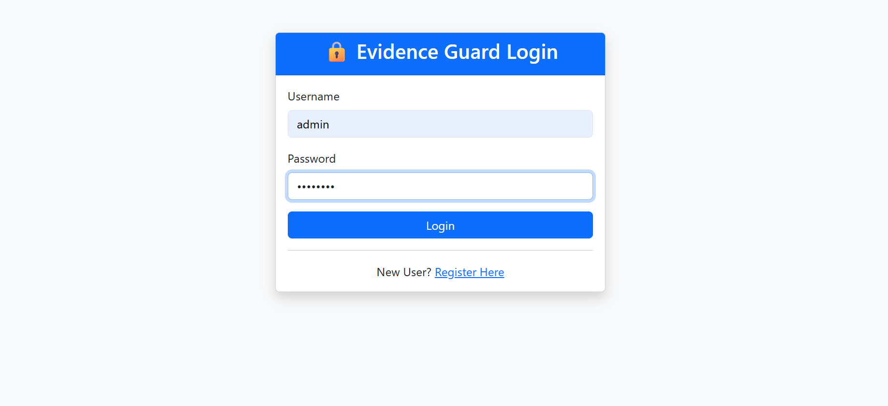
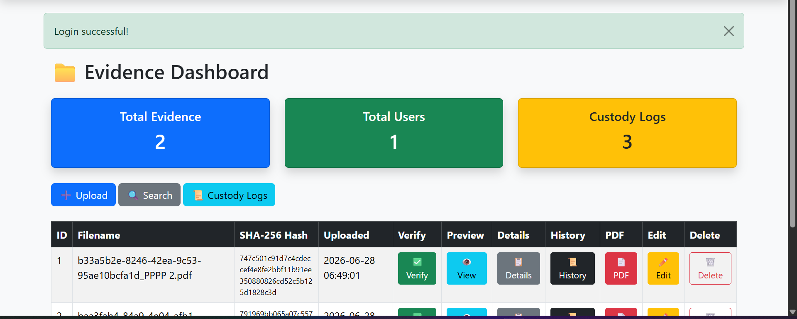
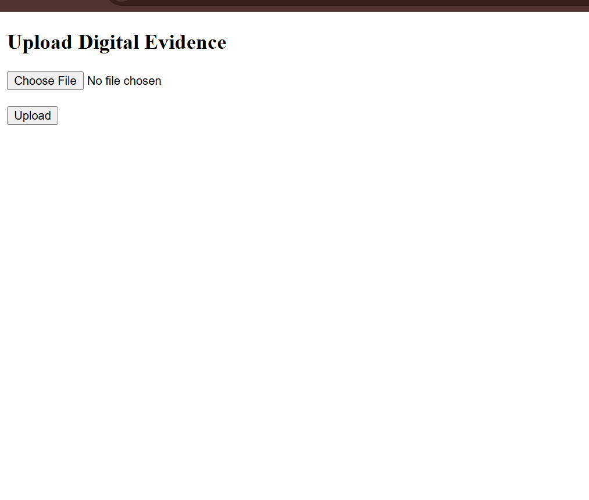

# 🛡️ EvidenceGuard

EvidenceGuard is a Flask-based Digital Evidence Management System that securely stores and manages digital evidence while maintaining a complete chain of custody.

## Features

- 🔐 User Authentication
- 📁 Secure Evidence Upload
- 📜 Chain of Custody Tracking
- 👨‍💼 Admin Dashboard
- 💾 SQLite Database
- 🌐 Flask Web Application

## Technologies Used

- Python
- Flask
- SQLAlchemy
- SQLite
- HTML
- CSS
- JavaScript

## Installation

```bash
git clone https://github.com/sonu-balagavi15/EvidenceGuard.git
cd EvidenceGuard
pip install -r requirements.txt
python app.py
```

## Project Structure

```
EvidenceGuard/
├── app.py
├── config.py
├── models.py
├── requirements.txt
├── static/
├── templates/
├── uploads/
└── instance/
```

## Future Enhancements

- Blockchain-based evidence verification
- AI-powered evidence analysis
- Cloud storage integration
- Multi-user role management

- ## 📸 Screenshots

### Login Page


### Dashboard


### Upload Evidence


### Evidence Details


### Chain of Custody


## Author

**Sonu**
